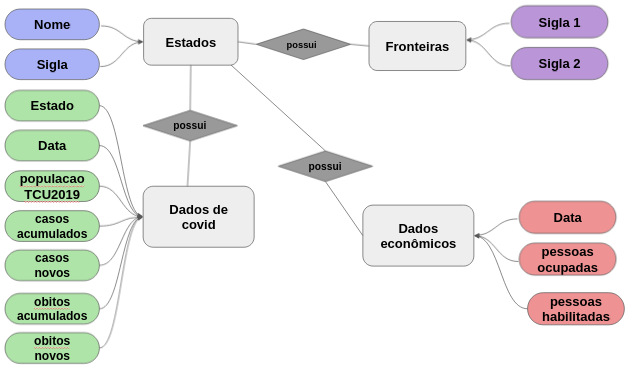
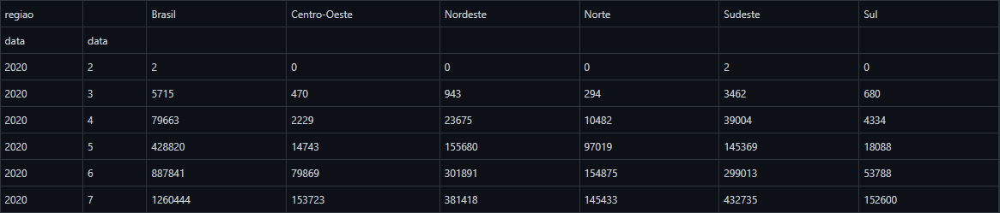

# Projeto de Banco de Dados - EquipeDupla ED: Covid-19

# Equipe `EquipeDupla` - `ED`
* `Lucas Fernandes André` - `182495`
* `Mariana Alves de Sousa` - `241201`

## Resumo do Projeto
> O projeto atualmente visa relacionar dados sobre o covid de cada estado para ter uma comparação entre eles e fazer uma análise sobre como a pandemia afetou o emprego das pessoas no Brasil.

## Slides da Apresentação
> 

## Modelo Conceitual Preliminar
> 

## Modelos Lógicos Preliminares

> 

## Dataset Preliminar a ser Publicado

Dados de ocupação e de covid | [arquivo](data/processed/test_database_) | É possível através desse dataset observar a relação entre o número de pessoas ocupadas e dados de óbitos nos meses da pandemia.

## Bases de Dados
Coronavírus Brasil | [covid.saude](https://covid.saude.gov.br/)| Síntese de casos, óbitos, incidência e mortalidade por covid.
IpeaData | [ipeadata](http://www.ipeadata.gov.br/) | Dados econômicos e financeiros do Brasil em séries anuais, mensais e diárias na mesma unidade monetária.

## Operações realizadas para a construção do dataset
* [operações realizadas sobre dados de covid](notebooks/pre_processamento_covid.ipynb)
* [operações realizadas sobre dados de economia](notebooks/pre_processamento_economicos.ipynb)

## Perguntas de Pesquisa/Análise Combinadas e Respectivas Análises
* [Pergunta respondida](notebooks/perguntas.ipynb)

### Pergunta 1
* O mês de 2020 que teve maior número de óbitos foi o mesmo mês que teve menor número de pessoas ocupadas?
** Será feito uma análise sobre a tabela de pessoas ocupadas e número de óbitos, comparando os meses do ano de 2020.
