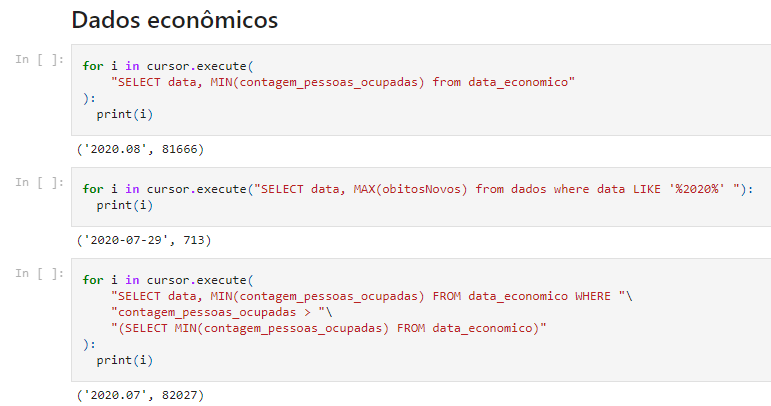
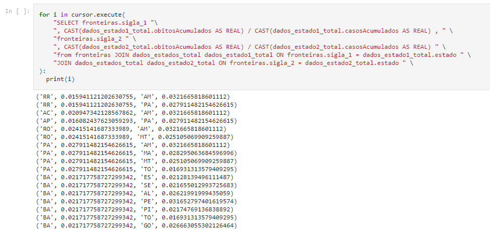

# Projeto de Banco de Dados - EquipeDupla ED: Covid-19

# Equipe `EquipeDupla` - `ED`
* `Lucas Fernandes André` - `182495`
* `Mariana Alves de Sousa` - `241201`

## Resumo do Projeto
> O projeto atualmente visa relacionar dados sobre o covid de cada estado para ter uma comparação entre eles e fazer uma análise sobre como a pandemia afetou o emprego das pessoas no Brasil.

## Slides da Apresentação
> 

## Modelo Conceitual Preliminar
> 

## Modelos Lógicos

> estados (sigla, nome)
> 
> fronteiras (sigla_1, sigla_2)
> 
> dados (estado, data, semanaEpi, populacaoTCU2019, casosAcumulados, casosNovos, obitosAcumulados, obitosNovos)
> 
> pessoas_habilitadas (data, contagem_pessoas)
> 
> pessoas_ocupadas (data, contagem_pessoas)

## Dataset Preliminar a ser Publicado

É possível através do dataset observar a relação entre o número de pessoas ocupadas e dados de óbitos nos meses da pandemia.

## Bases de Dados
Coronavírus Brasil | [covid.saude](https://covid.saude.gov.br/)| Síntese de casos, óbitos, incidência e mortalidade por covid.
IpeaData | [ipeadata](http://www.ipeadata.gov.br/) | Dados econômicos e financeiros do Brasil em séries anuais, mensais e diárias na mesma unidade monetária.
Estados e siglas | [estados](https://raw.githubusercontent.com/leogermani/estados-e-municipios-ibge/master/estados.csv) | Tabela que apresenta o nome dos estados e suas respectivas siglas.

## Detalhamento do Projeto
O projeto pode ser dividido entre aquisição dos dados, adequação dos dados e as análises efetuadas

### Aquisição de dados
Graças à livre disponibilidade de dados por parte do governo, os dados IpeaData e Coronavírus Brasil puderam ser baixados diretamente dos sites oficiais, não necessitando da implementação de uma ferramenta mais robusta.

### Adequação de dados
A adequação de dados pode ser vizualizada no notebook [pre_processamento_final](https://github.com/marianalves10/trabalh_BD/blob/master/final/notebooks/pre_processamento_final.ipynb), onde as fontes de dados são limpadas para se adequarem melhor à nossa necessidade. É realzido um filtro tanto de colunas que não iriamos usar quanto de agregar os dias para separar os dados no espaçamento temporal que queríamos

### Análises efetuadas
A análise se encontra no notebook [perguntas final](https://github.com/marianalves10/trabalh_BD/blob/master/final/notebooks/perguntas_final.ipynb), nele utilizamos os dados que tínhamos para a partir de nossas hipóteses chegarmos a alguma conclusão se tais indagações  eram verdadeiras ou não

## Evolução do projeto
O projeto iniciou-se com um brainstorm de ideias sobre a ideia central do proejto, chegando à conclusão de que o tema escolhido seria Covid-19 no Brasil. A partir disso, optamos por explorar o aspecto economico no meio da pandemia e fazer uma relação direta com os casos de covid, além também de uma comparação entre os estados quanto à mortalidade e número de casos.

Nas etapas iniciais do projeto, foi pensado nas partes de modelo conceitual e lógico. Depois, partimos para implementação, em que foi realizado a extração de dados de fontes disponiveis online e o tratamento deles em Python usando principalmente o módulo Pandas. Já perto da conclusão do projeto, foi montado as tabelas em usando sqlite e também os modelos lógicos e conceituais foram atualizados.

## Perguntas de Pesquisa/Análise Combinadas e Respectivas Análises
* [Pergunta respondida](notebooks/perguntas_final.ipynb)

### Pergunta 1
* O mês de 2020 que teve maior número de óbitos foi o mesmo mês que teve menor número de pessoas ocupadas?
** 

Isto mostra que o mês que teve maior número de óbitos não foi o mês com o menor número de pessoas ocupadas. Nossa hipótese inicial se encontrava errada, uma possível justificativa é que o impacto das mortes tem um efeito retardado na economia, ou seja, seu impacto será sentido apenas posteriormente. Outra possível justificativa é que quando havia um maior número de pessoas ocupadas, havia mais transmissão e consequentemente mais mortes, o que poderia ser testado em uma análise posterior

### Pergunta 2
* Estados que fazem fronteiras um com o outro possuem índices de mortalidade similares?
** 

Isso nos mostra que o índice de mortalidade não é parecido com estados próximos, isto evidencia que as políticas tomadas por cada governo tem alto impacto nos índices de mortalidade, uma vez que não uma mudança muito grande em termos de comportamentos de população entre estados vizinhos, salvo para estados que possuem cidades muito populosas. Em uma análise posterior, poderia-se comparar munincípios vizinhos
